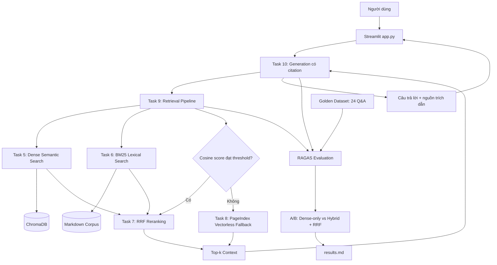

# Trợ Lý Hỏi Đáp Luật Lao Động Cho Người Trẻ

## Mục Tiêu

Xây dựng trợ lý RAG hỗ trợ người trẻ tra cứu các vấn đề pháp luật lao động phổ biến như thử việc, tiền lương, làm thêm giờ, nghỉ phép, hợp đồng lao động và chấm dứt hợp đồng.

---

## Sản phẩm RAG Chatbot

Chatbot sử dụng Bộ luật Lao động 2019, các văn bản hướng dẫn và tin/bài pháp luật đã thu thập làm nguồn dữ liệu. Câu trả lời được sinh từ context truy xuất và hiển thị nguồn tham khảo để người dùng kiểm chứng.

**Yêu cầu:**
- Giao diện chat (Streamlit / Gradio / Chainlit)
- Trả lời có citation (dựa trên Task 10)
- Hỗ trợ follow-up questions (conversation memory)
- Hiển thị source documents đã dùng

**Stack gợi ý:**
```
Chainlit/Streamlit → Retrieval (Task 9) → Generation (Task 10) → Display
```

---

## Yêu cầu 2: RAG Evaluation Pipeline

Sử dụng **1 trong 3 framework** sau để evaluate pipeline RAG của nhóm:

### Framework lựa chọn

| Framework | Cài đặt | Đặc điểm |
|-----------|---------|-----------|
| [DeepEval](https://github.com/confident-ai/deepeval) | `pip install deepeval` | Nhiều metric built-in, dễ integrate với pytest |
| [RAGAS](https://github.com/explodinggradients/ragas) | `pip install ragas` | Chuẩn industry cho RAG eval, 3 trục chính |
| [TruLens](https://github.com/truera/trulens) | `pip install trulens` | Dashboard UI, feedback functions mạnh |

### Yêu cầu Evaluation

1. **Tạo Golden Dataset** — tối thiểu 15 cặp Q&A (question, expected_answer, expected_context)
2. **Chạy evaluation** trên toàn bộ golden dataset với các metrics sau:
   - **Faithfulness** — câu trả lời có bám đúng context không?
   - **Answer Relevance** — câu trả lời có đúng câu hỏi không?
   - **Context Recall** — retriever có lấy đủ evidence không?
   - **Context Precision** — trong context lấy về, bao nhiêu % thực sự hữu ích?
3. **So sánh A/B** — chạy eval trên ít nhất 2 config khác nhau (ví dụ: có reranking vs không reranking, hoặc hybrid vs dense-only)
4. **Báo cáo** — bảng điểm + phân tích worst performers + đề xuất cải tiến

Xem code mẫu (DeepEval/RAGAS/TruLens) chi tiết trong `README.md` gốc mục "Yêu cầu 2".

### Deliverable Evaluation

- [x] File `group_project/evaluation/golden_dataset.json` — 24 cặp Q&A
- [x] File `group_project/evaluation/eval_pipeline.py` — script chạy evaluation
- [x] File `group_project/evaluation/results.md` — bảng điểm + phân tích
- [x] So sánh A/B `dense_no_rerank` và `hybrid_with_rerank`

---

## Yêu Cầu Chung

1. **Tích hợp pipeline** từ bài cá nhân của các thành viên
2. **Demo hoạt động được** trong buổi trình bày (chạy local hoặc deploy)
3. **Evaluation pipeline** chạy được và có báo cáo kết quả
4. **Code push lên repository** chung của nhóm
5. **README** mô tả kiến trúc và phân công (điền bên dưới)

---

## Kiến Trúc Hệ Thống



Luồng chuẩn kết hợp semantic search và BM25 bằng Reciprocal Rank Fusion (RRF). Điểm cosine gốc của dense retrieval được dùng riêng để quyết định fallback; nếu thấp hơn ngưỡng, Task 9 gọi PageIndex thay vì so sánh trực tiếp điểm RRF và cosine trên hai thang đo khác nhau. Task 10 sắp xếp lại context, gọi LLM và trả về câu trả lời kèm metadata nguồn cho giao diện.

---

## Phân Công Công Việc

| Thành viên | MSSV | Nhiệm vụ | Trạng thái |
|-----------|------|----------|------------|
| **Nguyễn Hồng Yến** (Leader) | 2A202601065 | Task 7: RRF reranking; Task 9: Retrieval Pipeline; tích hợp Streamlit UI, citation, A/B mode và conversation memory | Hoàn thành |
| **Nguyễn Văn Hưng** (Role 2)| 2A202601251 | Task 1–4: thu thập văn bản luật và tin bài; chuẩn hóa Markdown; chunking, embedding và lưu ChromaDB | Hoàn thành |
| **Đỗ Trung Kiên** (Role 3)| 2A202601287 | Task 5: Semantic Search; Task 6: BM25 Lexical Search; Task 10: Generation, reorder context và citation | Hoàn thành |
| **Nguyễn Đình Liêm** (Role 4)| 2A202601421 | Task 8: PageIndex fallback; Golden Dataset; RAGAS Evaluation Pipeline; A/B testing và báo cáo worst performers | Hoàn thành |

---

## Hướng Dẫn Chạy

### 1. Cài đặt và cấu hình

```powershell
# Cài đặt dependencies
pip install -r requirements.txt

# Sao chép file cấu hình mẫu, sau đó điền API key của bạn
Copy-Item .env.example .env
```

Các biến cần dùng tùy chức năng: `OPENAI_API_KEY` hoặc `OPENROUTER_API_KEY` cho generation/evaluation và `PAGEINDEX_API_KEY` cho vectorless fallback. Không commit file `.env`.

### 2. Chuẩn bị dữ liệu và index

```powershell
python -m src.task3_convert_markdown
python -m src.task4_chunking_indexing
python -m src.task8_pageindex_vectorless
```

### 3. Chạy kiểm thử và ứng dụng

```powershell
python -m pytest tests/test_individual.py -v

# Chạy app
streamlit run app.py
```

Ứng dụng hỗ trợ chế độ Dense-only và Hybrid + RRF, điều chỉnh `top_k`, hiển thị nguồn tham khảo và lưu lịch sử hội thoại trong Streamlit session state.

### 4. Chạy evaluation

```powershell
python -m group_project.evaluation.eval_pipeline
```

Kết quả tổng hợp được ghi vào `group_project/evaluation/results.md`; answer/context thô của từng cấu hình nằm trong `group_project/evaluation/artifacts/` để có thể tiếp tục sau timeout hoặc rate limit.


## Lưu ý

Hãy giữ lại repo này nếu như bạn học track 3 giai đoạn 2, chúng ta sẽ phát triển tiếp dự án lên knowledge graph để khắc phục các câu hỏi hóc búa khi có các câu hỏi khó.
